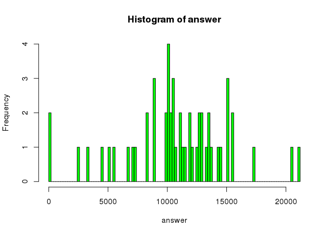
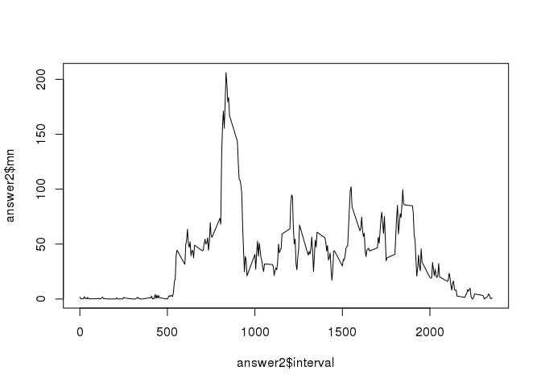

# Reproducible Research: Peer Assessment 1


## Loading and preprocessing the data


```r
library(data.table)
if (!file.exists("activity.zip")) {
    stop("data source file activity.zip missing")
}
DT <- data.table(read.csv(file = "activity.csv", header = TRUE, na.strings = "NA",  stringsAsFactors = FALSE))
DT$datedate <- as.Date(DT$date)
DT$datefactor <- as.factor(DT$date)
```

## What is mean total number of steps taken per day?


```r
DF <- data.frame(DT[complete.cases(DT)])
answer <- tapply(DF$steps, DF$datefactor, FUN = function(x) {sum(x, na.rm = TRUE)})
hist(answer, breaks = 100, col = "green")
```

 

```r
answer[is.na(answer)] <- 0
mean(answer)
```

```
## [1] 9354.23
```

```r
median(answer)
```

```
## [1] 10395
```


## What is the average daily activity pattern?


```r
answer2 <- aggregate(DF$steps, by = list(DF$interval), FUN = mean)
colnames(answer2) <- c("interval", "mn")
plot(answer2$interval, answer2$mn, type = "l")
```

 

```r
answer2[which.max(answer2$mn),]
```

```
##     interval       mn
## 104      835 206.1698
```


## Imputing missing values


## Are there differences in activity patterns between weekdays and weekends?
