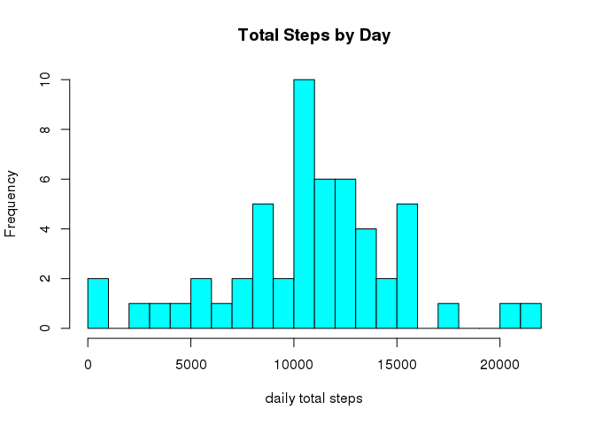
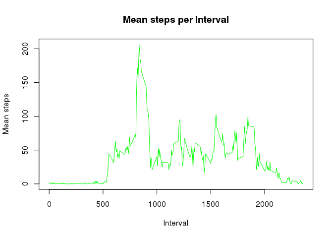
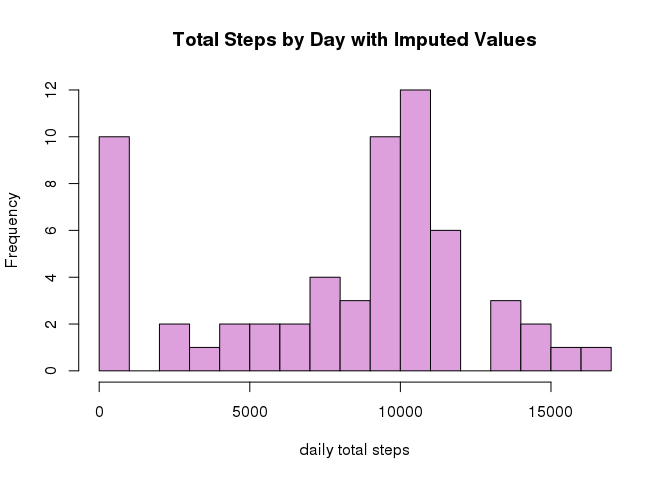
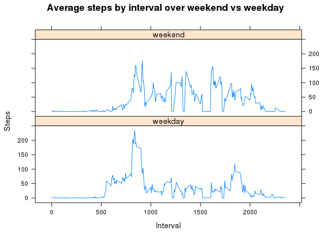

# Reproducible Research: Peer Assessment 1


## Loading and preprocessing the data


```r
library(lattice)

if (!file.exists("activity.zip")) {
    stop("data source file activity.zip missing")
}
activity <- read.csv(file = "activity.csv", header = TRUE, na.strings = "NA",  stringsAsFactors = FALSE)
```

## Total number of steps per day

Calculate the total by day.


```r
steps_by_date <- aggregate(steps ~ date, activity, sum)
```

Check the beginning of the result


```r
head(steps_by_date)
```

```
##         date steps
## 1 2012-10-02   126
## 2 2012-10-03 11352
## 3 2012-10-04 12116
## 4 2012-10-05 13294
## 5 2012-10-06 15420
## 6 2012-10-07 11015
```


Display a histogram over the daily totals.


```r
hist(steps_by_date$steps, breaks = nrow(activity)/1000, col = "cyan", main = "Total Steps by Day", xlab = "daily total steps")
```

 


## Mean and Median steps per day.


```r
m <- mean(steps_by_date$steps)
cat("Mean steps per day: ", m)
```

```
## Mean steps per day:  10766.19
```

```r
mm <- median(steps_by_date$steps)
cat("Median number of steps per day: ", mm)
```

```
## Median number of steps per day:  10765
```


## What is the average daily activity pattern?


```r
interval_means <- aggregate(activity$steps, by = list(activity$interval), FUN = mean, na.rm = TRUE)
colnames(interval_means) <- c("interval", "Mean")
plot(as.numeric(interval_means$interval), interval_means$Mean, type = "l", main = "Mean steps per Interval", xlab = "Interval", ylab = "Mean steps", col = "green")
```

 

## Which interval had the maximum average number of steps?


```r
intmax <- which.max(interval_means$Mean)
cat("Interval with the most steps is interval ", intmax)
```

```
## Interval with the most steps is interval  104
```


# Imputing missing values

Devise a strategy for filling in all of the missing values in the dataset. The strategy does not need to be sophisticated. For example, you could use the mean/median for that day, or the mean for that 5-minute interval, etc.

I will substitute the row means for 'NA' values but there are still a lot of zeroes that are valid observations.

First, count the number of rows with missing step values.


```r
n <- sum(is.na(activity$steps))
cat("Number of row with missing step values: ", n)
```

```
## Number of row with missing step values:  2304
```

Replace the NA values with the interval means. Find the NA slots, merge activity2 with the interval_means and replace the NAs.


```r
allnas <- is.na(activity$steps)
activity2 <- merge(activity, interval_means, by = "interval")
activity2$steps[allnas] <- activity2$Mean
```

```
## Warning in activity2$steps[allnas] <- activity2$Mean: number of items to
## replace is not a multiple of replacement length
```

Make a histogram of the total number of steps taken each day and Calculate and report the mean and median total number of steps taken per day. Do these values differ from the estimates from the first part of the assignment? What is the impact of imputing missing data on the estimates of the total daily number of steps?


```r
new_steps_by_date <- aggregate(steps ~ date, activity2, sum)
hist(new_steps_by_date$steps, breaks = nrow(activity2)/1000, col = "plum", main = "Total Steps by Day with Imputed Values", xlab = "daily total steps")
```

 

Show mean and median and compare to values from original data


```r
cat("New mean is ", mean(new_steps_by_date$steps))
```

```
## New mean is  8045.568
```

```r
cat("New median is ", median(new_steps_by_date$steps))
```

```
## New median is  9705.509
```

Both the mean and median became lower when the imputed values were added. I expected both to approach each other instead.


## Are there differences in activity patterns between weekdays and weekends?

Make a panel plot containing a time series plot (i.e. type = "l") of the 5-minute interval (x-axis) and the average number of steps taken, averaged across all weekday days or weekend days (y-axis).
First, add a (factor) column for the weekday vs weekend value.  Start by determining the week day and then group as weekday or weekend.


```r
activity2$wday <- as.POSIXlt(activity2$date)$wday
activity2$wkdy <- ifelse(activity2$wday %in% c(6,0), "weekend", "weekday")
split_activity <- aggregate(steps ~ interval + wkdy, data = activity2, mean)

xyplot(steps ~ interval | wkdy, data = split_activity, type = "l", layout = c(1,2), xlab = "Interval", ylab = "Steps", main = "Average steps by interval over weekend vs weekday")
```

 

People seems to step more consistently over the intervals on the weekends; during the weekdays there are neglected intervals.


